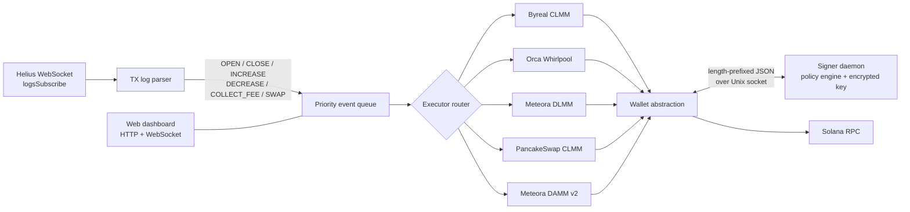
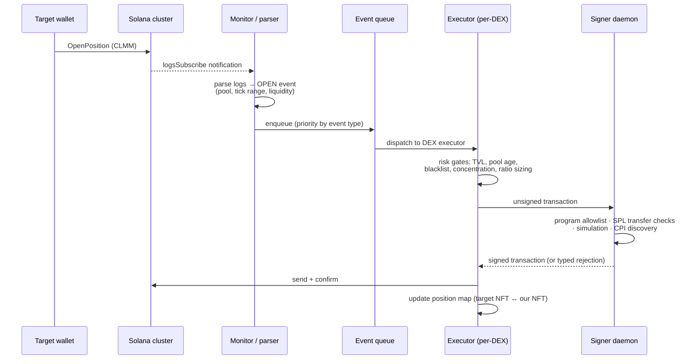

# CLMM Copy Bot

[](https://github.com/egg5233/clmm-copybot/actions/workflows/ci.yml)

A production Solana LP copy-trading bot that mirrors concentrated-liquidity positions across **five DEXes** — Byreal, Orca Whirlpool, Meteora DLMM, Meteora DAMM v2, and PancakeSwap CLMM — with an out-of-process, policy-enforcing transaction signer.

This system has been running in production with real funds since early 2026. This repository is a sanitized copy of that codebase (clean history, no credentials or strategy parameters), maintained as an engineering showcase.

> 中文文件請見 [README.zh-TW.md](README.zh-TW.md)

## What it does

The bot subscribes to the transaction logs of one or more _target wallets_ over a Helius WebSocket. When a target opens, increases, decreases, or closes a CLMM liquidity position — or performs a Jupiter swap — the bot parses the raw transaction logs into a typed event, filters it through configurable risk gates (pool TVL, pool age, token blacklist, coin-concentration caps, pump-token approval flow), and replays a proportionally-sized version of the same operation from its own wallet on the same pool.



One copied trade, end to end:



## Security model: the signer daemon

The design assumption is that a bot which parses untrusted on-chain data and calls third-party SDKs **will eventually misbehave** — through a bug, a malicious pool, or a compromised dependency. The private key is therefore isolated in a separate process that treats the bot as untrusted input:

- **Key isolation.** The key exists only inside the signer daemon, encrypted at rest with AES-256-GCM (scrypt KDF). It is unlocked interactively — via a localhost-only web page or stdin — and never touches the bot process, its config, or its logs.
- **Policy engine.** Every transaction the bot submits is deserialized and inspected before signing:
  - program allowlist (~29 programs: the five DEXes, system/token programs, and known Jupiter route intermediaries) — any unknown program is a rejection;
  - SPL token instruction inspection — `SetAuthority` is always rejected; transfer destinations must be whitelisted, be an ATA of a whitelisted owner, or occur inside a DEX transaction;
  - transaction simulation with CPI discovery — programs invoked indirectly must also pass the allowlist.
- **Trust boundary.** Compromise of the bot process does not yield the key, and constrains an attacker to the operations the policy allows. The model does _not_ defend against compromise of the host itself or of an allowlisted on-chain program.

This is the same problem shape as permission systems for autonomous AI agents: an untrusted automated process, a policy layer with hard guarantees, and a human-in-the-loop unlock step. A **Rust rewrite of the signer** lives in [`signer-rs/`](signer-rs/): a drop-in daemon verified byte-for-byte against the TypeScript implementation by golden vectors and a differential harness, fixing six security gaps found during the port (frame-size cap, pipelined-frame stall, unenforced SPL `Approve`, key zeroization, unlock rate limiting, opt-in socket peer authentication). See [signer-rs/README.md](signer-rs/README.md) for the design write-up.

## Features

- **Five DEX integrations** with per-DEX executors sharing a common event model: open / close / increase / decrease / collect-fee, plus Jupiter swap mirroring (Ultra and Metis modes).
- **Risk gates:** minimum pool TVL (Jupiter or universal source), minimum pool age with per-token whitelist, token black/whitelists, per-coin USD/percentage concentration caps, drawdown circuit breaker, per-token loss-streak cooldown, position-count cap.
- **Pump-token approval flow:** unknown pump tokens are held pending and approved/rejected interactively (Discord buttons via a self-hosted notification proxy, or dashboard).
- **Position reconciliation:** background on-chain audits detect orphaned or drifted positions and queue corrective closes.
- **Web dashboard:** live event feed over WebSocket, position and PnL views, asset trend charts, config editing with `.env` write-back, signer unlock proxy, manual swap queue.
- **Auto-claim** of weekly copy-trading bonuses and **daily auto-convert** (DAC) of profits into cbBTC.

## Quickstart

Requires Node.js 20+.

```bash
npm ci
cp .env.example .env         # fill in RPC URLs, target wallets, wallet key
npx ts-node src/index.ts     # or: npm run build && npm start
```

For the recommended two-process setup (bot + signer daemon), see [`signer/`](signer/): run `signer/setup.ts` once to encrypt your key, start the signer, and set `WALLET_PUBLIC_KEY` + `SIGNER_SOCKET_PATH` in the bot's `.env` instead of `PRIVATE_KEY`.

### Key configuration

| Variable                                                                             | Purpose                                                          |
| ------------------------------------------------------------------------------------ | ---------------------------------------------------------------- |
| `RPC_URL` / `WS_URL`                                                                 | Helius RPC + WebSocket (transaction send and log subscription)   |
| `ALCHEMY_RPC_URL`                                                                    | Optional read-only RPC to avoid indexer lag                      |
| `TARGET_WALLETS`                                                                     | Comma-separated wallets to mirror, with optional `:ratio` suffix |
| `AMOUNT_RATIO`                                                                       | Position size relative to target (e.g. `0.5` = 50%)              |
| `WALLET_PUBLIC_KEY` + `SIGNER_SOCKET_PATH`                                           | Signer mode (recommended) — bot builds unsigned TXs only         |
| `PRIVATE_KEY`                                                                        | Legacy single-process mode (avoid)                               |
| `DRY_RUN`                                                                            | Parse and log without trading                                    |
| `MIN_POOL_TVL`, `MIN_POOL_AGE_DAYS`, `TOKEN_BLACKLIST`, `MAX_COIN_CONCENTRATION_USD` | Risk gates                                                       |
| `DASHBOARD_PASSWORD`, `DASHBOARD_PORT`                                               | Enable the web dashboard                                         |

The full reference (60+ variables) is documented in [.env.example](.env.example) and [README.zh-TW.md](README.zh-TW.md).

## Project structure

```
src/
├── index.ts                 # entry: event queue, dispatch, pool backfill
├── monitor/                 # WebSocket subscription, TX log parser, TVL filters
├── executor/                # one executor per DEX + Jupiter swap, auto-claim, DAC
├── state/                   # position map (target NFT ↔ our NFT), pending approvals
├── dashboard/               # HTTP + WebSocket dashboard, asset trend collector
├── discord/                 # notifications via self-hosted worker proxy
└── utils/                   # wallet abstraction (signer client), logger, ratio math
signer/                      # out-of-process signing daemon (TypeScript)
signer-rs/                   # Rust rewrite: drop-in daemon + differential harness
tests/                       # regression tests (one per production incident)
docs/                        # design documents
```

## Engineering practices

- **A regression test per production incident.** Most files in `tests/` exist because something once went wrong with real money on the line; the test pins the fix.
- **Agentic development.** The system is built and maintained with Claude Code under a documented workflow — see [docs/agentic-workflow.md](docs/agentic-workflow.md). The signer's policy engine doubles as the guardrail layer that makes autonomous operation acceptable.
- **Changelog discipline.** Every deploy is versioned and recorded in [CHANGELOG.md](CHANGELOG.md) (65KB and counting).

## Roadmap

| Item                                                                                                                                    | Status                               |
| --------------------------------------------------------------------------------------------------------------------------------------- | ------------------------------------ |
| Vitest migration + lint + CI                                                                                                            | done — 141 tests                     |
| **Rust signer** (`signer-rs/`): drop-in daemon, differential test harness vs the TS implementation, byte-identical signing verification | done — 170 tests, 18/18 differential |
| **Postgres persistence**: replace JSON-file state with a repository layer, migrations, docker-compose                                   | done — 12 tables, 159 DB tests       |
| Prometheus metrics + health endpoints                                                                                                   | planned                              |

## License

[MIT](LICENSE)
