# Postgres migration

The bot kept sixteen JSON files under `./data/`. Twelve of them were state — the
kind of thing you cannot rebuild by asking an API again — and they were persisted
by the same pattern throughout: read the whole file, mutate an object in memory,
serialise the whole thing back. That pattern has two failure modes the bot hit in
production, and this change replaces those twelve files with Postgres tables.

Two files stay exactly where they are. They are caches, and the reasons are at
the bottom.

## The two defects that motivated this

### A 336KB write on every event

`data/event-log.json` held `{poolMap, events}` with the event array capped at
1000 entries. Appending one event meant `JSON.stringify` over the whole object
and a synchronous `writeFileSync` — about 336KB at the cap. During a burst, that
is hundreds of kilobytes of blocking I/O per copied trade, on the same thread
that is supposed to be racing a target wallet onto a position.

```ts
// src/index.ts — the old append path
function saveEventLog(log: EventLogEntry[]): void {
  fs.writeFileSync(EVENT_LOG_FILE, JSON.stringify({ poolMap: eventPoolMap, events: log }));
}
```

`data/asset-trend.json` had the same shape of problem on a slower clock: three
arrays (`raw`, `hourly`, `daily`) rewritten in full every 5 minutes, around 1.2MB
per snapshot once the unbounded daily tier had built up.

An append is now one `INSERT`, and the cap is a `DELETE` in the same transaction
rather than an array splice on the way out.

### Five writers, one file, no locking

`data/pending-swaps.json` is written by five executor modules — `byreal`, `orca`,
`meteora`, `pancakeswap`, `dammv2` — and each of them does this:

```ts
const data = this.readPendingFile();          // parse the whole file
data[mintStr] = { ...entry, pending: total }; // touch one mint
this.writePendingFile(data);                  // write the whole file back
```

Two positions closing on different DEXes at the same time means the second
writer's `readPendingFile()` already happened before the first one's write
landed. Its write then puts back a snapshot that does not contain the first
writer's mint, and a pending swap silently disappears — real tokens the bot then
never sells.

Making each mint its own row removes the race by construction: a write to mint A
cannot touch mint B, whatever the interleaving. `pendingSwaps.accumulate()` closes
the remaining same-mint gap by doing the addition inside the statement over
`NUMERIC`, so concurrent credits to one mint both land instead of one overwriting
the other.

## Schema

```mermaid
erDiagram
    positions {
        text        target_nft PK
        text        our_nft
        text        dex          "NULL means byreal"
        text        pool
        text        target_wallet
        numeric     locked_sol
        integer     tick_lower
        integer     tick_upper
        numeric     target_liquidity
        timestamptz created_at
        timestamptz updated_at
    }

    events {
        bigserial   id PK
        timestamptz ts           "indexed DESC"
        text        type
        text        target_wallet
        text        target_nft
        text        our_nft
        text        tx_sig
        boolean     success
        text        error
        text        pool
        text        dex
    }

    event_pool_map {
        text target_nft PK
        text pool
    }

    asset_snapshots {
        bigserial   id PK
        text        granularity "CHECK raw|hourly|daily"
        timestamptz ts          "UNIQUE with granularity"
        numeric     tokens_usd
        numeric     lp_value_usd
        numeric     unclaimed_usd
        numeric     bonus_usd
        numeric     locked_sol_usd
        numeric     total_usd
        numeric     sol_price
        numeric     sol_balance_usd
        numeric     per_dex_breakdown "15 columns: {byreal,orca,meteora,pcs,dammv2} x {lp,fees,locked}"
    }

    pending_swaps {
        text        input_mint PK
        jsonb       payload
        timestamptz updated_at
    }

    swap_history {
        bigserial   id PK
        timestamptz ts
        text        input_mint
        text        tx_sig
        text        input_amount_raw  "u64 as text"
        integer     input_decimals
        text        output_amount_raw
    }

    auth_log {
        bigserial   id PK
        timestamptz ts
        text        ip
        text        event
    }

    claim_history {
        bigserial   id PK
        text        week
        timestamptz ts
        jsonb       payload
    }

    dac_history {
        bigserial   id PK
        timestamptz ts
        jsonb       payload
    }

    token_pnl {
        text        mint PK
        jsonb       payload
        timestamptz updated_at
    }

    opened_referers {
        text        referer_position PK
        text        target_nft "indexed"
        text        our_nft
        text        target_wallet
        timestamptz opened_at
    }

    pump_pending {
        text        mint PK
        text        symbol
        text        pool
        text        target_wallet
        timestamptz detected_at
        text        status "CHECK pending|approved|rejected"
        timestamptz notified_at
        timestamptz resolved_at
    }

    positions ||..o| event_pool_map : "same target NFT"
    positions ||..o{ events : "same target NFT"
    positions ||..o| opened_referers : "same target NFT"
```



There are no foreign keys, deliberately. The tables share NFT mints as
identifiers, but they have independent lifetimes: `event_pool_map` is meant to
outlive the position row so a closed position's pool is still resolvable, and an
event is a historical record that must not vanish because a position was deleted.
A foreign key would enforce the opposite of what the bot wants.

| Table | Replaces | Cap |
| --- | --- | --- |
| `positions` | `position-map.json` | none |
| `events` | `event-log.json` (`events`) | 1000 |
| `event_pool_map` | `event-log.json` (`poolMap`) | none |
| `asset_snapshots` | `asset-trend.json` | 576 raw / 720 hourly / daily unbounded |
| `pending_swaps` | `pending-swaps.json` | none |
| `swap_history` | `swap-history.json` | 40 |
| `auth_log` | `auth-log.json` | 200 |
| `claim_history` | `claim-history.json` | 52 |
| `dac_history` | `dac-history.json` | 365 |
| `token_pnl` | `token-pnl.json` | none |
| `opened_referers` | `opened-referers.json` | none |
| `pump_pending` | `pump-pending.json` | none |

Every table carries a `COMMENT` naming the file it replaces, so the mapping is
discoverable from `psql` without this document. A test asserts those comments
exist.

### Notes on specific choices

**Caps moved into SQL.** Each capped table's `push`/`append` runs the `INSERT` and
a `DELETE ... WHERE id < (SELECT id ... ORDER BY id DESC OFFSET cap-1 LIMIT 1)` in
one transaction. The cap is therefore a property of the store rather than
something each caller has to remember, which matters for `swap_history`: it had
two independent writers, each trimming its own in-memory array before rewriting
the file, so whichever wrote last silently truncated the other's rows.

**`NUMERIC`, not `double precision`.** `target_liquidity` is a u128 and swap
amounts are u64. Both exceed what a JS number represents exactly, and both are
carried as BN strings in the bot. `NUMERIC` round-trips them exactly; `pg`
returns it as a string, which is what BN wants anyway. USD values use `NUMERIC`
for the same reason at a smaller scale — the collector already rounds to cents,
and binary floats do not hold cents.

**Raw amounts as `TEXT` in `swap_history`.** These are display records that are
never summed, so there is nothing to gain from `NUMERIC` and the text form is
exactly what the dashboard renders.

**Epoch milliseconds at the boundary.** The bot speaks `ts: number` throughout.
The columns are `TIMESTAMPTZ` — the right type for an instant, and it makes the
data legible in `psql` — and `src/state/db.ts` converts in both directions so no
call site has to change.

**`granularity` as a checked column, not three tables.** The three asset-trend
tiers hold identical rows and differ only in sampling interval and retention. One
table plus `CHECK (granularity IN ('raw','hourly','daily'))` and a
`UNIQUE (granularity, ts)` keeps the queries uniform. That unique constraint also
retires a bug the file version carried: `loadTrend()` deduplicated the hourly and
daily tiers on every startup ("last entry per bucket wins") to repair historical
duplicate writes. The upsert makes duplicates unable to form.

### Where JSONB is used, and why

Four tables keep an untyped `payload JSONB` column: `pending_swaps`, `token_pnl`,
`claim_history`, `dac_history`. In every case the value is untyped *today* —
`Record<string, any>` on disk, with the shape spread across several writers — and
promoting the fields to columns needs an audit this change is not the place for.

- `pending_swaps.payload` — five executor modules write it, agreeing on
  `{pending, botReceived, createdAt}` but each adding fields. Closing the shape
  means checking all five.
- `token_pnl.payload` — the executor writes four fields; the dashboard merges
  display fields into the same object on read, so the shape is not closed.
- `claim_history.payload` / `dac_history.payload` — wide display-only records.
  Nothing queries their fields, so columns would buy nothing yet.

Where a field *is* queried it was lifted out: `claim_history.week` (the scheduler
asks "did we already claim this week?") and `ts` on both, for ordering and caps.
Typing the rest is follow-up work, and JSONB means it can happen per-field
without a rewrite.

## Files that stay on disk

`data/token-names.json` and `data/tvl-cache.json` are **caches**, not state. Both
are rebuildable by asking an API again; deleting them costs a few requests and
nothing else. They have no concurrent-writer problem, no cap to enforce, no
query beyond "give me the value for this mint", and no reason to make the bot's
startup depend on a database. Putting them in Postgres would add a dependency
without removing a failure mode.

`data/bot.lock` also stays: it is a single-instance guard whose whole job is to
work before anything else is up.

## Why Postgres and not SQLite

The bot is a single writer process. On that basis SQLite would be enough, and it
would be a smaller dependency: no container, no connection string, no separate
lifecycle. That is a real argument and it is worth stating plainly rather than
pretending Postgres was the only option.

Postgres was chosen for three reasons that outweigh it here:

1. **The bot is not quite a single writer.** The dashboard runs in the same
   process today but is a separate concern with its own write paths — the
   force-swap route appends to swap history, the auth log is written on every
   login attempt. Splitting the dashboard out is a plausible next step, and
   SQLite's single-writer lock would become the constraint at exactly that point.
2. **The concurrency fix wants real row-level semantics.** The `pending_swaps`
   defect is fixed by per-row writes and by `accumulate()` doing arithmetic inside
   the statement. SQLite can express both, but with a database-level write lock
   the property being relied on is "only one writer at a time" rather than "these
   writers do not conflict" — the same fix, resting on a weaker guarantee.
3. **The deployment already runs containers.** `docker-compose.yml` brings up the
   bot and the Rust signer; a `postgres:16-alpine` service alongside them costs
   one more entry, not a new class of infrastructure. The operational argument for
   SQLite is strongest when there is no container story, and there is one here.

If the dashboard never splits out and the deployment moves to a bare process,
SQLite would be the better answer and the repository layer is the seam that makes
switching cheap: all SQL lives in `src/state/repo/*`, and only `src/state/db.ts`
constructs a client.

## Layout

```
migrations/0001_initial_schema.sql   node-pg-migrate, up and down
src/state/db.ts                      lazy pg Pool, transactions, ts conversion
src/state/repo/                      one module per store, owns all SQL
tests/repo/                          integration tests against a real Postgres
```

Nothing outside `src/state/db.ts` constructs a pg client, and nothing outside
`src/state/repo/*` writes SQL. Each repository module mirrors the public API of
the JSON-backed module it replaces, method for method, so adopting it at the call
sites is mechanical: swap the import, `await` the call.

## Running it

```bash
npm run db:start     # docker compose up -d postgres
npm run migrate      # node-pg-migrate -m migrations up
npm test             # includes the repository integration suites
npm run db:stop      # docker compose down
```

`DATABASE_URL` drives everything. `src/state/db.ts` throws a startup error naming
these commands when it is unset — persisting nowhere is a worse outcome than
refusing to start.

The full stack, including the bot and the signer:

```bash
docker compose --profile bot up
```

`migrate` runs as a one-shot service and the bot waits for it with
`condition: service_completed_successfully`, so the bot never starts against an
unapplied schema.

## Testing

`tests/repo/*.test.ts` run against a real Postgres, never a mock. What the
repository layer *consists of* is SQL — upserts, CHECK constraints, cap-enforcing
DELETEs, NUMERIC arithmetic under concurrency — so a mocked client would assert
nothing about the thing under test.

The database comes from `DATABASE_URL` when set (CI provides one as a service
container), otherwise `tests/repo/global-setup.ts` starts a throwaway
`postgres:16-alpine` on a random free port and removes it in teardown. With
neither available the suites skip with a console note. Migrations are applied
through node-pg-migrate's JS API, so the tests exercise the same schema
`npm run migrate` produces rather than a hand-maintained copy.

Two details worth knowing if you touch that harness:

- Readiness is checked by connecting over TCP and running `SELECT 1`, not by
  `docker exec pg_isready`. The postgres entrypoint runs initdb against a
  bootstrap server first, and `pg_isready` reports *that* one as ready over the
  local socket; migrations started at that moment die with "Connection terminated
  unexpectedly" when the real server takes over. The bootstrap server never
  listens on TCP.
- vitest runs test files in parallel against the one database, so a suite may
  only truncate the tables it owns and no two suites may own the same table.
  `useTestDatabase(tables)` takes the list explicitly for that reason.
